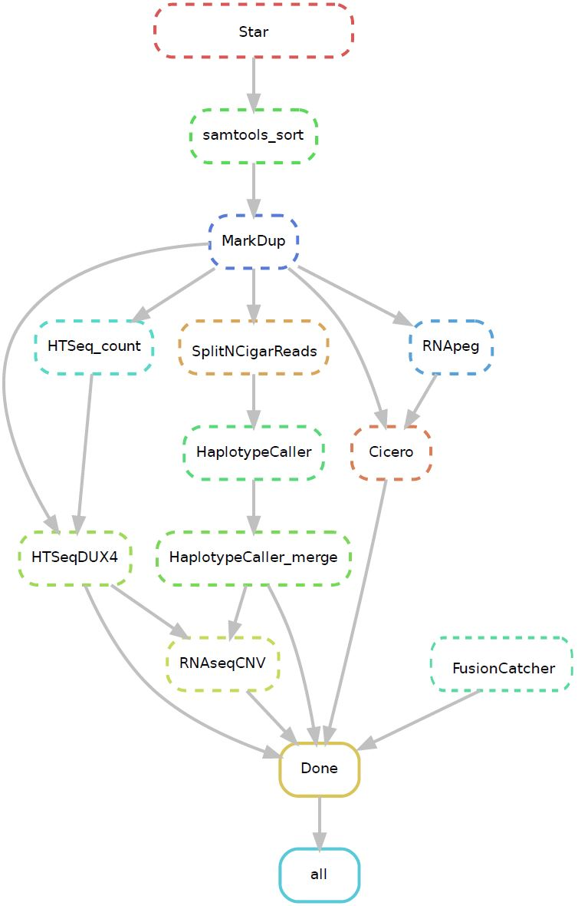

<!-- README.md is generated from README.Rmd. Please edit that file -->

```{r, include = FALSE}
knitr::opts_chunk$set(
  collapse = TRUE,
  comment = "#>",
  fig.path = "man/figures/README-",
  out.width = "100%",
  dev = 'pdf'
)

# knitr::opts_knit$set(root.dir = '/scratch/zuhu/project/BALL/MDALL/')

# knitr::opts_knit$set(root.dir = 'c://Users/zuhu/OneDrive - City of Hope National Medical Center/project/ZGu/B_ALL/MD-ALL/')

knitr::opts_knit$set(root.dir = '/home/zgu_labs/pipeline_online/rnaseq/')

```

# Analysis pipeline for RNA-seq data
This pipeline is specifically designed for the analysis of RNA-seq data to fit our B-ALL subtypes prediction pipeline [MD-ALL](https://github.com/gu-lab20/MD-ALL).Upon execution, the pipeline will produce outputs detailing gene read counts, mutations, fusions, and chromosomal-level copy number variations (gains/losses) derived from the RNA-seq data.You can choose to install all the packages yourself or use the Singularity containers we have created, which include all the essential software. The use of Singularity containers is highly recommended, as some of the software can be challenging to install correctly. This pipeline is still under active development, and new analyses regarding B-ALL subtype prediction will be released.

The pipe written in [Snakemake](https://snakemake.readthedocs.io/en/stable/). 

The workflow of this pipeline:
<br>


<br>
<br>

## For singularity container users
Please [download](https://drive.google.com/drive/folders/1U9RTa7qC9uYLbFaFplJsGeHkC14HIdL-?usp=sharing) the singularity containers and the reference database. 

### Configuration
Users will need to edit the run_rnaseq.smk file for configurations.

Parameters: 

'<strong>ref_fa</strong>', the fasta file of reference genome of human GRCh38. Users need to download it. 

'<strong>gtf</strong>', gtf annotation file of the reference genome. Users need to download it. 

'<strong>bed_DUX4</strong>', bed file of DUX4 genes. This file is used in the read counts patching process for DUX4 genes. Already included in the 0.ref directory. 

'<strong>ref_star</strong>', the directory of reference used by STAR to do alignment. Users will get it after the installation of STAR.

'<strong>ref_fusioncatcher</strong>', the directory of reference used by FusionCatcher to call gene fusions. Users will get it after the installation of FusionCatcher. 

'<strong>ref_cicero</strong>', the directory of reference used by Cicero to call gene fusions. Users will get it after the installation of Cicero. 

'<strong>ref_RNApeg_flat</strong>', the refFlat file used by RNApeg. Already included in the 0.ref directory. 

'<strong>cores_star</strong>', '<strong>cores_samtoolsSort</strong>', '<strong>cores_fusioncatcher</strong>', '<strong>cores_RNApeg</strong>' and '<strong>cores_cicero</strong>' are the number of threads used by the the corresponding software.

'<strong>dir_in</strong>', the directory of input fastq files. Only gz compressed paired-end fastq files are supported currently. The file names should follow the pattern {sample}.R1.fq.gz and {sample}.R2.fq.gz. If a sample id is COH000456_D1, then the fastq file names should be COH000456_D1.R1.fq.gz and COH000456_D1.R2.fq.gz.

'<strong>dir_out</strong>', the output directory. Results will be stored in sub-directories within this folder, each named according to the respective sample ID.

'<strong>samplelist</strong>', the sample ID list that will be processed for analysis. The corresponding fastq files need to be stored in the directory '<strong>dir_in</strong>'. 

### Pipeline running
Before running, making sure the [singularity](https://docs.sylabs.io/guides/3.5/user-guide/introduction.html) is correctly installed and loaded.
```{bash, message=FALSE,warning=FALSE,error=FALSE,eval=FALSE}
singularity exec --bind /full_path_to_ref/ref \
/full_path_to/app_gulab_rnaseq-20231121_haswell.sif  \
snakemake -s run_rnaseq.smk --rerun-incomplete -p -j16 --keep-going
```

Since fusion calling based on Cicero sometimes runs very slowly, users may choose whether to use it or not. Therefore, we have developed a separate Singularity container for Cicero to facilitate fusion calling.
To run fusion calling using the Cicero Singularity container, please use the following codes:
```{bash, message=FALSE,warning=FALSE,error=FALSE,eval=FALSE}
singularity exec --bind/full_path_to_Cicero_ref/ref \
/full_path_to/cicero_0.3.0p2.sif \
Cicero.sh -n 8 -b input.bam -g GRCh38_no_alt -r ref -j input.junctions -s 2 -c 10 -o output
```


## For non-singularity users

### Dependencies
#### Please install all the needed softwares before running this pipeline:

[perl-v5.26.2](https://www.perl.org/)

[Snakemake-7.16.0](https://snakemake.readthedocs.io/en/stable/) 

[STAR-2.7.2b](https://github.com/alexdobin/STAR) 

[samtools-1.12](http://www.htslib.org/) 

[GATK-4.3.0.0](https://gatk.broadinstitute.org/hc/en-us) 

[HTSeq-count-0.13.5](https://htseq.readthedocs.io/en/release_0.11.1/count.html) 

[FusionCatcher-1.33](https://github.com/ndaniel/fusioncatcher) 

[RNApeg](https://github.com/stjude/RNApeg) 

[Cicero-0.3.0p2](https://github.com/stjude/CICERO) 

[RNAseqCNV-1.2.2](https://github.com/honzee/RNAseqCNV) 

### Configuration
Configuration please refer to the singularity part.

### Run the pipeline
To run the pipeline with 16 cores:
```{bash, message=FALSE,warning=FALSE,error=FALSE,eval=FALSE}
snakemake -s run_rnaseq.smk -p -j16
```


